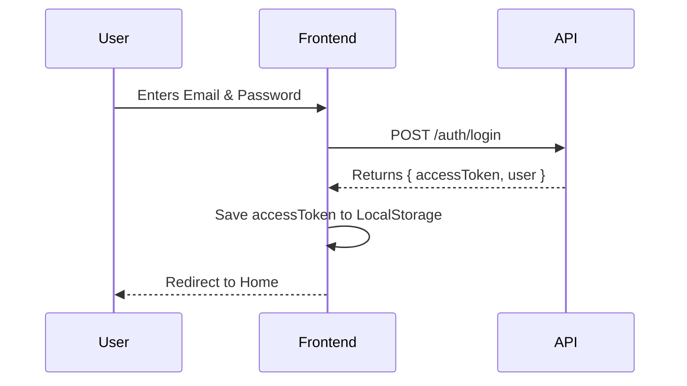
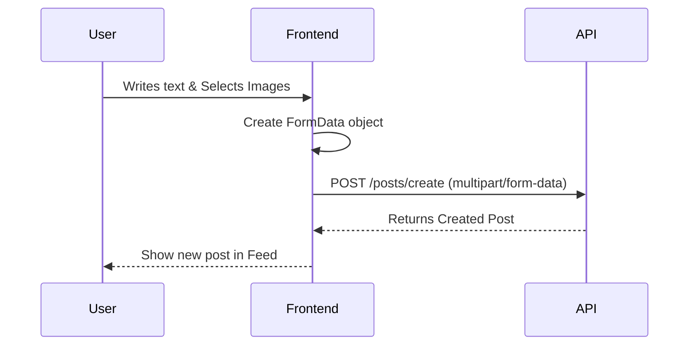

# 📘 Ding Platform API Documentation - The Ultimate Frontend Guide

Welcome to the **Ding Platform API**. This guide is designed to be your copy-paste resource. It includes **actual code snippets**, **visual flows**, and **detailed explanations**.

---

## 🚀 Quick Start (Copy This First)

You will need a way to make requests. We recommend **Axios**.

**Base URL:** `http://localhost:3000/api`

### 1. Setup Axios Client

Create a file named `api.js` or `api.ts` and paste this. It handles the token automatically!

```javascript
import axios from "axios";

const api = axios.create({
  baseURL: "http://localhost:3000/api",
  headers: {
    "Content-Type": "application/json",
  },
});

// Automatically add token to every request
api.interceptors.request.use((config) => {
  const token = localStorage.getItem("accessToken"); // Assumes you save token here
  if (token) {
    config.headers.Authorization = `Bearer ${token}`;
  }
  return config;
});

export default api;
```

---

## 🔐 Authentication Module

### Visual Flow: Login



### 1. Login

**Endpoint:** `POST /auth/login`

```javascript
// Usage Example
async function login(email, password) {
  try {
    const response = await api.post("/auth/login", { email, password });

    // 1. Save the token!
    localStorage.setItem("accessToken", response.data.accessToken);

    // 2. Save user info (optional)
    console.log("Logged in as:", response.data.user.name);

    return response.data;
  } catch (error) {
    console.error("Login failed:", error.response?.data?.message);
  }
}
```

### 2. Signup

**Endpoint:** `POST /auth/signup`

```javascript
async function signup(name, email, password) {
  const response = await api.post("/auth/signup", { name, email, password });
  return response.data;
}
```

### 3. Logout

**Endpoint:** `DELETE /auth/logout`

```javascript
async function logout() {
  await api.delete("/auth/logout");
  localStorage.removeItem("accessToken"); // Don't forget to clear token!
}
```

---

## 📝 Posts Module

### Visual Flow: Creating a Post



### 1. Create Post (The Tricky One!)

**Endpoint:** `POST /posts/create`
**Important:** You must use `FormData` for file uploads.

```javascript
async function createPost(content, privacy, imageFiles = [], videoFiles = []) {
  const formData = new FormData();

  // Add text fields
  formData.append("content", content);
  formData.append("privacy", privacy); // 'PUBLIC', 'FRIENDS', 'ONLY_ME'

  // Add files (Loop through arrays)
  imageFiles.forEach((file) => formData.append("images", file));
  videoFiles.forEach((file) => formData.append("videos", file));

  // Axios automatically sets Content-Type to multipart/form-data
  const response = await api.post("/posts/create", formData);
  return response.data;
}
```

### 2. Get Feed (Pagination)

**Endpoint:** `GET /posts`

```javascript
async function getPosts(page = 1) {
  const response = await api.get(`/posts?page=${page}&limit=20`);

  const posts = response.data; // Array of posts
  // Each post has: id, content, author, _count (likes/comments)
  return posts;
}
```

### 3. Toggle Like

**Endpoint:** `POST /posts/:id/like`

```javascript
async function toggleLike(postId) {
  const response = await api.post(`/posts/${postId}/like`);
  return response.data.liked; // true if liked, false if unliked
}
```

---

## 👥 Social Module

### 1. Follow User

**Endpoint:** `POST /social/follow/:userId`

```javascript
async function followUser(targetUserId) {
  await api.post(`/social/follow/${targetUserId}`);
}
```

### 2. Send Friend Request

**Endpoint:** `POST /social/friends/request/:userId`

```javascript
async function sendFriendRequest(targetUserId) {
  await api.post(`/social/friends/request/${targetUserId}`);
}
```

---

## 🛡️ Privacy Module

### 1. Update Privacy

**Endpoint:** `PATCH /privacy`

```javascript
async function updatePrivacy(settings) {
  // settings = { profileVisibility: 'FRIENDS', ... }
  const response = await api.patch("/privacy", settings);
  return response.data;
}
```

---

## ❌ Error Handling Cheat Sheet

If the API fails, check `error.response.status`:

| Status Code          | Meaning                         | What to do?                                                          |
| :------------------- | :------------------------------ | :------------------------------------------------------------------- |
| **400 Bad Request**  | You sent invalid data.          | Check your JSON body or missing fields.                              |
| **401 Unauthorized** | Token is missing or invalid.    | Redirect user to Login page.                                         |
| **403 Forbidden**    | You aren't allowed to do this.  | User might not have permission (e.g., deleting someone else's post). |
| **404 Not Found**    | ID doesn't exist.               | The post/user/comment ID is wrong.                                   |
| **500 Server Error** | Something broke on the backend. | Report this to the backend team!                                     |

---

**Need help?**
Check the `Ding-Platform-API.postman_collection.json` for raw request examples!
